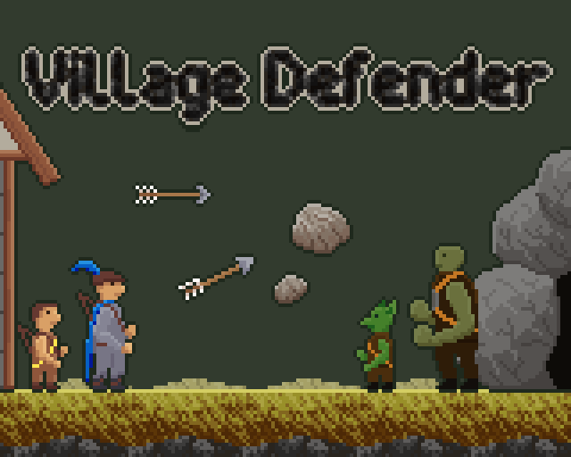
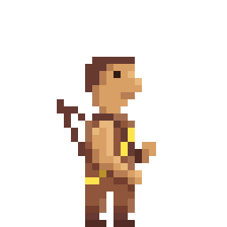

# Ludum Dare 51

  

> _**[Play the game!](https://levi.dev/ludum-dare-51)**_
> 
> _**[Watch a gameplay video!](https://www.youtube.com/watch?v=Ix7IdaGE3AA)**_

_🏹 Lead the village the defend against relentless waves of monsters!_

## ‍👨‍💻 The jam

[Ludum Dare](https://ldjam.com/events/ludum-dare/51/) is a semi-annual event where people create a game over the weekend.
-   It is a ranked competition, with a clever voting system that gets more eyes on your game when you in turn rate other games.
-   There are a few different tracks you can participate in; I usually do the more-challenging "**Compo**" track, where you must create all your own art, music, sounds, etc. from scratch, work by yourself, and finish within **48 hours**.
-   The games all follow some central theme, which is only announced at the start of the jam.

I worked solo and created everything during the event (the Compo track). Except of course for my frameworks (which is fine, you're allowed to use pre-existing code).

### 💡 The theme

"Every 10 seconds"

## 💿 Software used

-   **[Godot](https://godotengine.org/):** Game engine.
-   **[Aseprite](https://www.aseprite.org/):** Pixel-art image editor.
-   **[Bfxr](https://www.bfxr.net/):** Sound effects editor.
-   **[FamiStudio](https://famistudio.org/):** Chiptune music tracker.
-   **[Surfacer](https://godotengine.org/asset-library/asset/968):** Framework for procedural path-finding across 2D platforms.
-   **[Scaffolder](https://godotengine.org/asset-library/asset/969):** Framework for general app and UI infrastructure.
-   **[SurfaceTiler](https://github.com/SnoringCatGames/surface_tiler):** Framework for "next-level" autotiling.

## ⚙️ Getting set up

> **NOTE:** This repo uses [Git submodules](https://git-scm.com/book/en/v2/Git-Tools-Submodules) to include frameworks.

To learn more about how the code works, checkout the [Surfacer](https://github.com/SnoringCatGames/surfacer/) and [Scaffolder](https://github.com/SnoringCatGames/scaffolder/) READMEs.

## 📃 Licenses

-   All code is published under the [MIT license](LICENSE).
-   All art assets (files under `assets/images/`, `assets/music/`, and `assets/sounds/`) are published under the [CC0 1.0 Universal license](https://creativecommons.org/publicdomain/zero/1.0/deed.en).
-   This project depends on various pieces of third-party code that are licensed separately. Here are lists of these third-party licenses:
    -   [addons/scaffolder/src/config/scaffolder_third_party_licenses.gd](https://github.com/SnoringCatGames/scaffolder/blob/master/src/config/scaffolder_third_party_licenses.gd)
    -   [addons/surfacer/src/config/surfacer_third_party_licenses.gd](https://github.com/SnoringCatGames/surfacer/blob/master/src/config/surfacer_third_party_licenses.gd)
    -   [src/config/third_party_licenses.gd](./src/config/third_party_licenses.gd)

  

